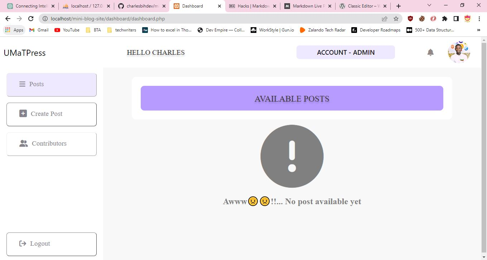

## Intro

Hello, I'm Charles Owusu Bih, an aspiring software developer. This is my second PHP project. My first project was a simple Crud application in which I added an upload image feature. Check out my first PHP project [here](http://charles-crud.infinityfreeapp.com/create.php). I am a blogger and WordPress developer; basically, I got the MINI-PRESS inspiration from **WordPress**.

## About MINI-PRESS

This is a simple blog site that allows users to sign up. The app stores all the data in a database and retrieves it later. After signing up, the user can log in to his dashboard to view his posts. If there are no posts, the app will indicate this after clicking on the post tab in the sidebar.

- ## Posts Tab

  

The posts tab displays the posts you have written (Account-Users) and all posts in the database (Account-Admin). Admins can see all posts, but users can see posts they have written. On every post, there are three buttons: View, Edit, and Delete. The view opens the article in a new tab. The blogger can copy the link to that article and share it with other people so they can view his blog. The edit is used to edit a particular post, and the delete is also used to delete the post, as the name suggests.

- ### Create Post

Users can click on the Create Post button to create a blog post. There are three sections on the Create Post page, which include: The title area, where users can type the title of the blog they are about to publish, The thumbnail area also helps users choose the image they want to use as their post's thumbnail photo and the main content. The main content is made by the WYSIWYG editor, which formats all that you type in an HTML format and submits it to the database (lol😉 I got this idea from a WordPress plugin called <a href="https://wordpress.org/plugins/classic-editor/" title="Classic Editor">Classic Editor</a>
There are two buttons: publish and discard. One is used for publishing, and one discards the post, respectively.

## Setting Up MINI-PRESS

Sorry😪 I couldn't deploy the project. I tried deploying it on the free hosting site, and everything was working fine except the main blog page, where users cannot view blog posts. This is the cause: I used an SEO-friendly slug method, that is, the blog post URL will look like **http://sitename/the-slug-of-the-post** This requires a.htaccess file to rewrite every URL that does not point to any directory as **http://sitename/blog.php?slug=the-slug-of-the-post**. Then I can use the $_GET php superglobal to fetch that specific post from the database using the slug. These free hosting sites do not allow you to do this because they assume blog sites etc. use a lot of resources.

- ### Setting up on a local server (phpmyadmin as db)

1. Download the zip file which contains all the files in this repo and extract it
2. Create a Database on **phpmyadmin** and give it a name
3. Click on **import** tab at the top of the page
4. Click on choose file. open the database folder of the downloaded file and select blog_site.sql
5. Once you have selected the file click on the GO button to start importing the tables.
6. Locate the conn.php and update various variables(password, username, database etc.).
7. Start your server and launch the app.

- ### Setting up on a local server (mysqli Command Line client as db)

1.  Create a Database.
2.  The command below is used to switch to your created database.
     <code>USE my_database.</code> 

3.  Now you can import the SQL file to your command line client using the following command. 
    <code> source /path/to/your/file.sql;</code> 
    Replace path/to/your/file.sql with the path to the blog_site.sql.

4.  Now mysqli command line client will execute the sql file and create the necessary tables for you.

5.  These SQL commands create a new user 'charlesbih' with the password 'Bih222' and grant all privileges on the 'blog_site' database to this user. The FLUSH PRIVILEGES command refreshes the grant tables in the MySQL database to ensure that the privileges take effect immediately.

        CREATE USER 'charlesbih'@'localhost' IDENTIFIED BY 'Bih222';
        GRANT ALL PRIVILEGES ON blog_site.\* TO 'charlesbih'@'localhost';
        FLUSH PRIVILEGES;

6.  Locate the conn.php and update various variables(password, username, database, etc.) with the details of the new user you created.
7.  Start your server and launch the app.

# Conclusion

Contributions and Corrections are welcome!

If you find any issues or errors in the project, please don't hesitate to raise them in the issue tracker or submit a pull request to help improve the project. Feedback is appreciated and I accept constructive criticism.

To support me or buy me a coffee, please visit my [Linktree](https://linktr.ee/charlesbihdev). I appreciate any support you can give!
