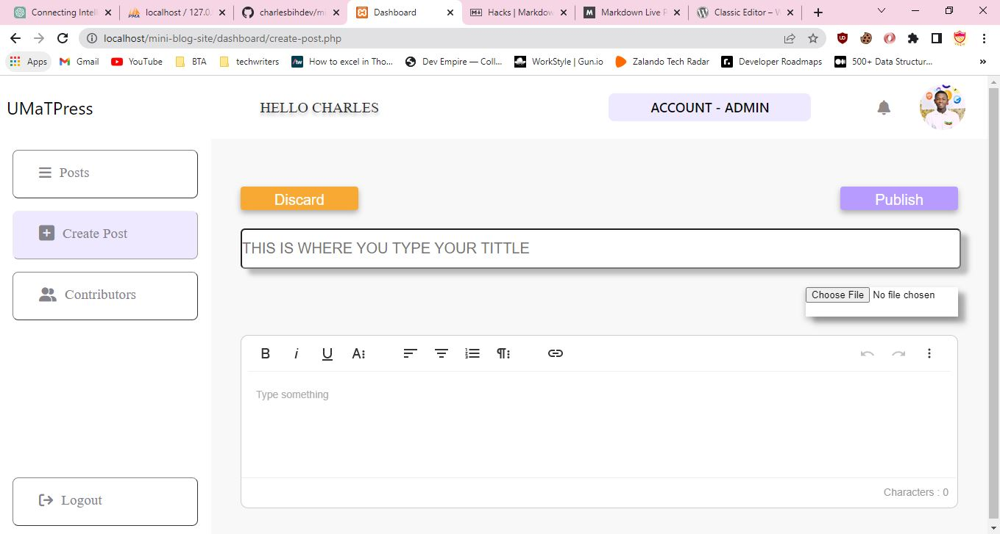

## Intro

Hello I'm Charles Owusu Bih, an aspiring software Developer. This is my second PHP project. My first project was a simple crud application which I added an upload image feature, checkout my first php project [here](http://charles-crud.infinityfreeapp.com/create.php). I decided to try something new this time by building a mini blog website. I decide to name it UMAT-PRESS. UMAT is University of Mines and Technology(My current institution) and Press comes from **Wordpress**. I am a blogger and wordpress developer, basically I got the UMAT-PRESS inspiration from **wordpress**.

## About UMAT-PRESS

This is a simple blogsite which allows users to sign up. The app stores all the data in a database and retrieve it later. After signing up the user can log in to his dashboard to view his posts. If there are no posts the app will indicate after clicking on the post tab on the sidebar.

- ## Posts Tab

  

  The posts tab displays the posts you have written(Account - Users) and displays all posts in the dabase(Account - Admin). Admins can see all posts but users see posts they have written. On every post there are theree buttons(icons) that is the View, Edit, Delete. The view opens the article in a new tab. The blogger can copy the link of that article and share it to other people for them to view his blog. The Edit is used to Edit a particular post and the delete is also used to delete the post as the name suggest.

- ### Create Post

  Users can click on the create post and create a blog post. There are three sections in the create post page which includes: The title area, where users can type the title of the blog they are about to publish. The Thumbnail area, which also helps users to choose the image they want to use as thier post's thumbnail photo and the main content. The main content is made of WYSIWYG editor which formats all what you type in an HTML format and submits it to database (lol😉 I got this idea from a wordpress plugin called
**[Classic Editor](https://wordpress.org/plugins/classic-editor/)**) . There are two buttons Publish and Discard. One is used for publishing and one discard the post respectively.

## Setting Up UMAT-PRESS

Sorry😪 I couldnt deploy the project. I tried deploying it on free hosting site and everything was working fine except the main blog page which user cannot view blog posts. This is the cause: I used an SEO friendly slug method that is blog post url will look like **http://sitename/the-slug-of-the-post** This requires an .htaccess file to rewirte every url that does not point to any directory as **http://sitename/blog.php?slug=the-slug-of-the-post**. Then I can use the $\_GET php superglobal to fetch that specific post from the database using the slug. These free hosting sites do not allow you to do this because the assume blog sites etc. use a lot of resources.

- ### Setting up on a local server (phpmyadmin as db)

1. Download the zip file which contails all the files in this repo and extract it
2. Create a Database on **phpmyadmin** and give it a name
3. Click on **import** tab at the top of the page
4. Click on choose file. open the database folder of the downloaded file and select blog_site.sql
5. Once you have selected the file click on GO button to start importing the tables.
6. Locate the conn.php and update various variables(password, username, database etc.).
7. Start your server launch the app.

- ### Setting up on a local server (mysqli Command Line client as db)

1.  Create a Database.
2.  The command below is used to switch to your created database.
    <code>USE my_database.</code>

3.  Now you can import the sql file to your command line client using the following command.
    <code> source /path/to/your/file.sql;

    Replace path/to/your/file.sql with the path to the blog_site.sql. </code>

4.  Now mysqli command line client will execute the sql file and create the neccessary tables for you.

5.  These SQL commands create a new user 'charlesbih' with the password 'Bih222' and grants all privileges on the 'blog_site' database to this user. The FLUSH PRIVILEGES command refreshes the grant tables in the mysql database to ensure that the privileges take effect immediately.

        CREATE USER 'charlesbih'@'localhost' IDENTIFIED BY 'Bih222';
        GRANT ALL PRIVILEGES ON blog_site.\* TO 'charlesbih'@'localhost';
        FLUSH PRIVILEGES;

6.  Locate the conn.php and update various variables(password, username, database etc.) with the details of the new user you created.
7.  Start your server launch the app.

# Conclusion

Contributions and Corrections are welcome!

If you find any issues or errors in the project, please don't hesitate to raise them in the issue tracker or submit a pull request to help improve the project. Feedback is appreciated and I accept constructive criticism.

To support me or buy me a coffee, please visit my [Linktree](https://linktr.ee/charlesbihdev). I appreciate any support you can give!
